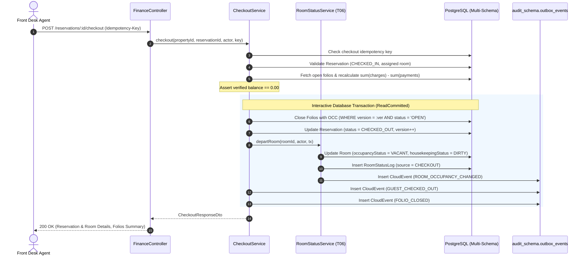

# W1-T08: Checkout & Folio Settlement — Architecture & Implementation Reference

## 1. Overview & Purpose

W1-T08 implements the core **Finance & Cashiering** domain for the Enterprise Hotel Management System (HMS), specifically providing:

- **Guest Folio Aggregate**: Managing itemized billing accounts for hotel reservations.
- **Charge & Credit Posting Engine**: Immutable, append-only financial ledger tracking room charges, incidentals, and rebate adjustments with reason codes.
- **Payment Recording**: Immutable tender capture (Cash, Credit Card reference, City Ledger) with server-derived folio currency.
- **Departure Checkout Orchestration**: Atomic departure workflow validating strict zero-balance settlement, transitioning reservation status to `CHECKED_OUT`, and invoking T06 room departure.
- **Controlled T06 Boundary Integration**: Seamlessly invoking `RoomStatusService.departRoom()` to vacate physical rooms (`OCCUPIED` → `VACANT`) and flag housekeeping as `DIRTY`.
- **Persistent DB-Backed Idempotency**: Mission-critical protection against network retries, application restarts, and double charging/payments without depending on transient caching.

---

## 2. Domain Ownership & Boundaries

| Sub-Domain                    | Primary Schema   | Aggregate Roots & Owned Entities                | Ownership Invariants                                                                                                                                              |
| :---------------------------- | :--------------- | :---------------------------------------------- | :---------------------------------------------------------------------------------------------------------------------------------------------------------------- |
| **Finance / Folios (W1-T08)** | `finance_schema` | `Folio`, `FolioTransaction`, `Payment`          | Owns all ledger transactions, tender records, and balance calculations. Zero cross-schema foreign keys (uses logical UUID references).                            |
| **Reservations (W1-T05)**     | `pms_schema`     | `Reservation`, `ReservationRateNight`           | Owns booking lifecycle. T08 atomically updates `status` from `CHECKED_IN` to `CHECKED_OUT` with optimistic concurrency control (OCC).                             |
| **Room Operations (W1-T06)**  | `pms_schema`     | `Room`, `RoomStatusLog`, `RoomMaintenanceBlock` | Exclusively owns room physical operational status (`occupancyStatus`, `housekeepingStatus`, `serviceStatus`). T08 delegates via `RoomStatusService.departRoom()`. |

---

## 3. Financial Integrity & Ledger Architecture

### 3.1 Strict Decimal Precision

- All monetary amounts stored in PostgreSQL using `DECIMAL(12, 4)`.
- In memory, calculated via `Prisma.Decimal` arbitrary-precision arithmetic.
- In API DTOs, transported strictly as string decimals (e.g. `"200.0000"`). Floating-point `number` primitives are strictly prohibited in persistence and wire exchange.

### 3.2 Total Financial Effect Invariant

$$\text{FolioTransaction.amount} = \text{Total Financial Effect}$$

- `taxAmount` is stored purely as informational/subset data for reporting.
- **Balance Mutation Formula**:
  $$\text{Folio.balance} \mathrel{+}= \text{FolioTransaction.amount}$$
  _(Never calculate `balance += amount + taxAmount` which would double-count taxes)._

### 3.3 Running Balance Formula

$$\text{Folio.balance} = \sum(\text{FolioTransaction.amount}) - \sum(\text{Payment.amount})$$

- Materialized on `Folio.balance` inside the same database transaction.
- Recalculated from raw transaction and payment items at checkout to guarantee data integrity (`BALANCE_INTEGRITY_VIOLATION` if discrepancy detected).

### 3.4 Append-Only Ledger Immutability

- Financial transactions (`FolioTransaction`) and payments (`Payment`) are **immutable**.
- `UPDATE` and `DELETE` queries on posted ledger records are strictly prohibited.
- Adjustments and corrections are posted as new reversing credit transactions with a mandatory `reasonCode` and authenticated `postedBy` actor ID.

---

## 4. Business Decisions & Policies

### 4.1 Approved Business Decision: Strict Zero-Balance Checkout

In accordance with Enterprise HMS operational rules:

- **`Folio.balance > 0`**: **BLOCK CHECKOUT** (`409 Conflict: FOLIO_BALANCE_NON_ZERO`). Outstanding charges must be settled prior to departure.
- **`Folio.balance = 0`**: **ALLOW CHECKOUT**. All folios are completely settled.
- **`Folio.balance < 0`**: **BLOCK CHECKOUT** (`409 Conflict: FOLIO_BALANCE_NON_ZERO`).

### 4.2 Deferred Business Decision: Guest Credit & Refunds

- **Decision**: Negative folio balances (overpayments) block departure checkout.
- **Rationale**: Guest credits, cash disbursements, credit card refund merchant reversals, and advance deposits require explicit Corporate Finance policies and audit sign-off. These workflows are deferred to future finance iterations.
- **Extensibility**: When corporate policy permits checkout with negative balances (or automated refunding), this can be enabled in `CheckoutService` without altering schema or ledger models.

---

## 5. Idempotency & Concurrency Model

### 5.1 Mandatory DB-Backed Idempotency

`Idempotency-Key` HTTP header is **strictly required** on all 4 mutating financial endpoints:

1. `POST /api/v1/properties/:propertyId/pms/finance/folios`
2. `POST /api/v1/properties/:propertyId/pms/finance/folios/:folioId/charges`
3. `POST /api/v1/properties/:propertyId/pms/finance/folios/:folioId/payments`
4. `POST /api/v1/properties/:propertyId/pms/finance/reservations/:reservationId/checkout`

Missing header immediately yields `400 Bad Request (IDEMPOTENCY_KEY_REQUIRED)`.

### 5.2 Collision & Replay Semantics

- **Same Key + Same Payload**: Replays original committed response (Idempotent 200/201).
- **Same Key + Different Payload**: Rejects with `409 Conflict (IDEMPOTENCY_PAYLOAD_MISMATCH)` using SHA-256 canonical payload hashing.
- **Same Key + Different Entity**: Rejects with `409 Conflict (IDEMPOTENCY_KEY_REUSED_FOR_DIFFERENT_ENTITY)`.
- **Concurrent Races**: Database unique constraint enforces single winner; racing loser catches PostgreSQL `P2002` error, re-reads committed state, and returns original result.

### 5.3 Optimistic Concurrency Control (OCC)

- **Folio Mutations**:
  ```sql
  UPDATE finance_schema.folios
  SET balance = balance + :amount, version = version + 1
  WHERE id = :folioId AND version = :readVersion AND status = 'OPEN';
  ```
- **Folio Closure at Checkout**:
  ```sql
  UPDATE finance_schema.folios
  SET status = 'CLOSED', closed_at = NOW(), version = version + 1
  WHERE id = :folioId AND version = :readVersion AND status = 'OPEN';
  ```
  If another cashier posts a charge or payment between the balance check and closure, 0 rows are updated, triggering an immediate `409 Conflict (OCC_CONFLICT)` and rolling back the checkout transaction.

---

## 6. Complete Checkout Workflow



---

## 7. Developer FAQ

### What happens when a guest checks out?

`CheckoutService.checkout()` runs an interactive PostgreSQL transaction that verifies every open folio has a balance of exactly 0.00. It marks the reservation `CHECKED_OUT`, closes all folios, transitions the physical room to `VACANT` and `DIRTY` via T06, and emits domain CloudEvents into the outbox.

### What happens if the guest still owes money?

Checkout is rejected with `409 Conflict (FOLIO_BALANCE_NON_ZERO)`. The reservation stays `CHECKED_IN`, the room remains `OCCUPIED`, and no records are mutated.

### What happens if they overpaid?

Checkout is rejected with `409 Conflict (FOLIO_BALANCE_NON_ZERO)`. Per the approved T08 business rule, guest credit disbursement is deferred to corporate finance reconciliation workflows.

### What happens if two users try to check out simultaneously?

Reservation update uses OCC on `version`. The first transaction commits and increments `version`; the second transaction affects 0 rows, rolls back, and handles the key idempotently or throws `409 Conflict`.

### What happens if a payment arrives while checkout is happening?

Checkout checks the folio's `version`. If a concurrent payment commits after checkout's balance verification, the folio closure OCC (`WHERE version = :ver AND status = 'OPEN'`) affects 0 rows, aborting checkout with `409 Conflict (OCC_CONFLICT)` and rolling back all changes.

### What happens if the same API request is retried?

The persistent unique index on `check_out_idempotency_key` detects the prior execution, verifies the SHA-256 payload hash matches, and re-serves the identical checkout response without re-executing any business mutations.

### Where is the financial record stored?

In `finance_schema.folios`, `finance_schema.folio_transactions`, and `finance_schema.payments`.

### Who owns room status?

The Room Operations domain (W1-T06) exclusively owns physical room status. T08 never updates `Room` directly; it calls `RoomStatusService.departRoom()`.

### How does T08 communicate with T06?

Direct service injection passing the active `Prisma.TransactionClient` into `RoomStatusService.departRoom()`, ensuring atomic execution.

### How are financial events published?

Through the Transactional Outbox pattern into `audit_schema.outbox_events` within the same database transaction.

### How is property isolation enforced?

Controller routes enforce `@RequirePropertyContext()`. All queries filter by `propertyId` verified against the authenticated JWT `SecurityContext`.
